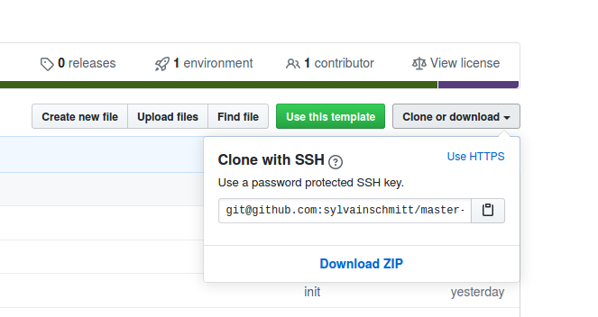
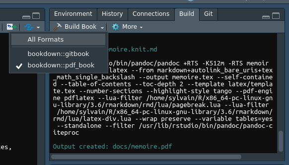

# Master thesis INP template

This is the template developped for master 2 student of the FOREN lab at INP-HB, Yamoussoukro, Ivory Coast.
You can have a preview of the [html book](https://sylvainschmitt.github.io/master-thesis-inp-template/) and the [pdf book](https://github.com/sylvainschmitt/master-thesis-inp-template/blob/master/docs/memoire.pdf) here.

## Prerequesite

You'll need to have the following software installed on your computer:

* [R](https://www.r-project.org/) 
* [Rstudio](https://rstudio.com/)

You'll need the following R packages with associated dependencies:

* [`rmarkdown`](https://rmarkdown.rstudio.com/)
* [`bookdown`](https://bookdown.org/)
* [`tinytex`](https://yihui.org/tinytex/r/)

```
install.packages(c('rmarkdown', 'bookdown', 'tinytex'))
```

You'll need then to install `tinytex` with the following command:

```
tinytex::install_tinytex()
```

I also strongly adviced to install the following (besides not mandatory):

* [Mendeley](https://www.mendeley.com/) or [Zotero](https://www.zotero.org/)
* [citr](https://github.com/crsh/citr)
* [tidyverse](https://www.tidyverse.org/)

```
install.packages(c('citr', 'tidyverse'))
```

## Installation

Download this is GitHub repository with link above or clone it with `git`



```
git clone git@github.com:sylvainschmitt/master-thesis-inp-template.git
```

## Getting started

Start by filling your informations in the `YAML` header of the index [`index.Rmd`](https://github.com/sylvainschmitt/master-thesis-inp-template/blob/master/index.Rmd):

```
title: "Titre du stage"
author: "Kouassi KONE"
option: "option"
type: "Forestier"
promotion: "y"
date: "2020"
encadreur_pedagogique: "Dr Koffi TRAORE"
encadreur_terrain: "Dr Yao MENSA"
epigraph: 
  text: "Une citation."
  author: "Un illustre inconnu"
```

Compile the PDF with the build button in Rstudio or CTRL+SHIFT+B.



Start then to write your thesis in the different chapters following examples for titles, references, figures, tables, and cross-referencing.

At any time, compile either the chapter you are writting with the knit button in Rstudio or CTRL+SHIFT+K or the whole mansucript with th build button in Rstudio or CTRL+SHIFT+B.

## Bibliography

Have a look to the `citr`  package. I recommand adding a keyboard shortcut such as CTRL+SHIFT+G in Rstudio preferences for a quicker management of the references.

## Bugs

* No common bugs yet, please use the [issue seciton](https://github.com/sylvainschmitt/master-thesis-inp-template/issues) in GitHub to report theim and get help

Sylvain Schmitt (*creator*)
